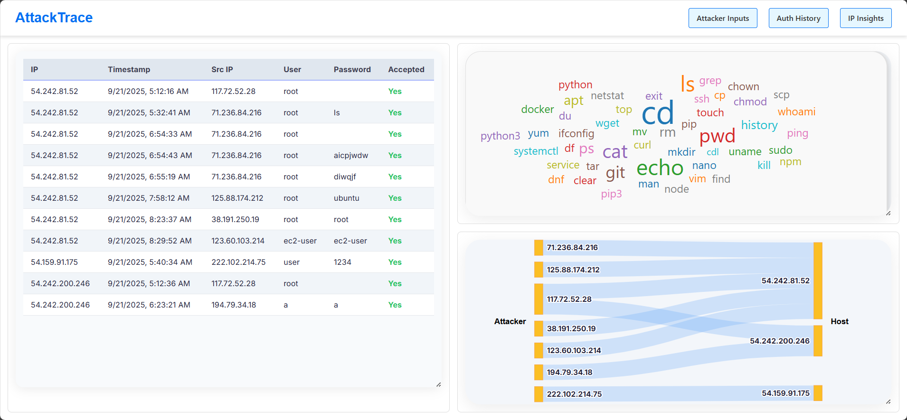
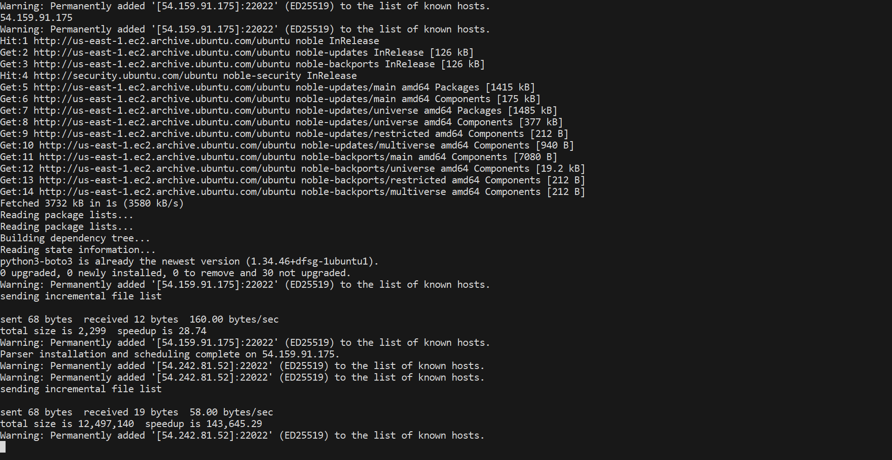

# AttackTrace

AttackTrace is a cloud-native honeypot analytics platform. It deploys lightweight SSH traps across many servers, streams logs into AWS DynamoDB, and transforms raw attacker data into real-time visual dashboards. With multi-server visibility, intuitive visualizations and real-time data, AttackTrace makes it easy to see brute-force patterns, credential reuse, and attacker behavior at a glance.





## Instructions

AttackTrace consists of **four main components**:

1. **SSH Honeypot** – captures attacker traffic.
2. **Log Parser** – processes raw honeypot logs and stream into AWS DynamoDB.
3. **RESTful APIs** – provide centralized access to aggregated attack data.
4. **Frontend Dashboard** – visualizes attacker activity in real time.

#### SSH Honeypot

We use the lightweight honeypot [sshesame](https://github.com/jaksi/sshesame?utm_source=chatgpt.com), with slight modifications to improve logging format. It simulates an SSH server, capturing connection attempts and commands without exposing a real system.

Deployment is automated via [install_sshesame.sh](sshesame/install_sshesame.sh)

```bash
Usage: ./script.sh <target_ip> <path_to_private_key>
```

This script will:

- Install and configure the honeypot on the target machine.
- Enable logging of attacker IP, timestamp, and attempted credentials.

#### Log Parser

Raw honeypot logs can be messy. The parser [parse_log.py](sshesame/parse_log.py) extracts key fields (IP, time, username, password, command, etc.) and put data into DynamoDB.

Deployment script: [install_parser.sh](sshesame/install_parser.sh)

```bash
Usage: ./install_parser.sh <target_ip> <path_to_ssh_key>
```

This will automatically copy and configure the parser on the remote machine, ensuring logs are normalized before ingestion.

#### Deploying HoneyPot + Log Parser on AWS

The script [configure_ssh.sh](configure_ssh.sh) is designed for enabling SSH access on port 22022 for user root.

```
Usage: ./configure_ssh.sh <ip> <path_to_private_key>
```

For larger deployments, [script.sh](script.sh) can bootstrap **honeypots + parsers across all available AWS EC2 instances** accessible with the provided credentials:

```bash
Usage: ./script.sh <path_to_private_key>
```

This lets you scale honeypot coverage across multiple servers with one command.

#### RESTful APIs

The backend consists of **AWS Lambda** functions deployed behind an **AWS HTTP API Gateway**. These functions handle:

- Collecting parsed logs from multiple servers.
- Aggregating attack data in real time.
- Serving queryable endpoints for the dashboard.

All Lambda sources can be found under [backend/](backend/).

#### Frontend Dashboard

The visualization dashboard is built with **Next.js + D3.js** for interactivity. It shows:

- A table of usernames, passwords, IP and time of the login attempts.
- A Sankey graph descripting the relationship between host IPs and attacker IPs.
- A word cloud of the top 50 commands that attackers are using.

Deployment details:

- Hosted on **AWS S3** as a static site.
- Domain managed via **Route 53**.

Accessing the dashboard gives you real-time insights into attacker behavior across your deployed honeypots.

